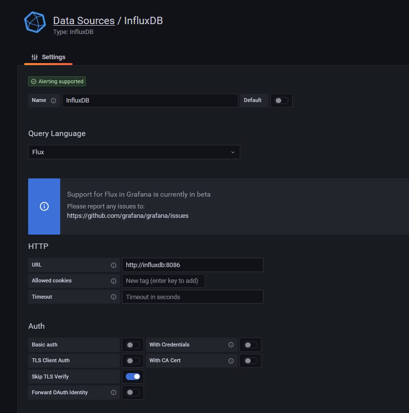
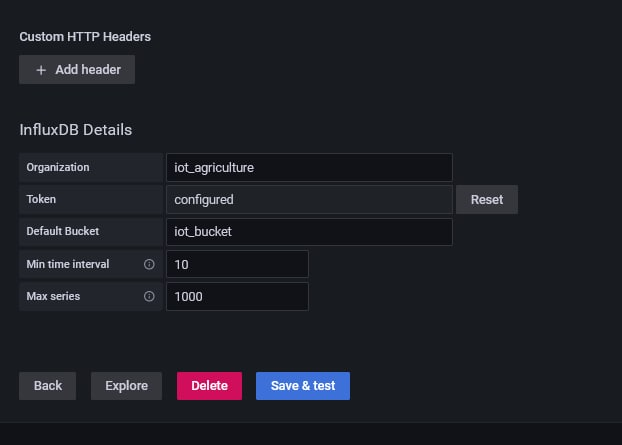

# IoT-platform-for-agriculture. <!-- omit in toc -->

Jade Gröli & David González León

---

- [1. Architecture](#1-architecture)
- [2. Sensors used on the](#2-sensors-used-on-the)
- [3. Development Steps](#3-development-steps)
  - [3.1. Plug and Sense](#31-plug-and-sense)
    - [3.1.1. Documentation](#311-documentation)
  - [3.2. The Thing Network](#32-the-thing-network)
  - [3.3. Azure](#33-azure)
    - [3.3.1. Azure functions](#331-azure-functions)
    - [3.3.2. InfluxDB Azure](#332-influxdb-azure)
    - [3.3.3. Azure Managed Grafana](#333-azure-managed-grafana)
- [4. Deployment](#4-deployment)

# 1. Architecture

-   Module Plug & Sense
    -   Récupère les données des capteurs
    -   Envoie packets à The Thing Network à travers LoRaWAN
-   The thing Network
    -   Formate les packets reçus avec une fonction javascript
    -   Envoie à Azure functions à travers Webhook
-   Azure
    -   Azure functions
        -   Récupère les données de The Thing Network
        -   Effectue les insertions dans la base de donnée InfluxDB
    -   InfluxDB Azure
        -   Hébergé sur Azure
        -   Récupère les données envoyées par Azure functions et les mets à disposition de Grafana
    -   Azure Managed Grafana
        -   Récupère les données de InfluxDB Azure
        -   Affiche les données du Module Plug & Sense

# 2. Sensors used on the

-   Temp, humidity, pressure : port F
-   Water sensor : port C
-   Soil temp : port D

# 3. Development Steps

## 3.1. Plug and Sense

Create the code for the Plug and Sense module to gather data from the sensors and send them to The Thing Network.

### 3.1.1. Documentation

Code example : https://development.libelium.com/plug-and-sense/code-examples

Sensors sockets map : https://development.libelium.com/plug-and-sense-technical-guide/models

## 3.2. The Thing Network

At first we need to create the application and link the device to it

-   Add the gateway to The Thing Network to monitor incoming packets
-   Create a new application on The Thing Network
-   Create an end device for our mote, and generate :
    -   Device EUI
    -   Application EUI
    -   Application Key
-   Add the three values to the code for the Plug and Sense module
-   Select LoRaWAN version 1.0.0

Once this is done, we receive the messages from the Plug and Sense module on The Thing Network. We now need to decode them. We setup a payload formatter function using a custom javascript function. This allows us to decode the messages and format them in a way that is easier to read and manipulate.

## 3.3. Azure

### 3.3.1. Azure functions

We created a function in Azure that receives the payloads from The Thing Network through a http webhook and inserts the data into the InfluxDB database. The function is written in python using python version 3.9. We first developed the function locally and tested it on a local InfluxDB database. Once we were sure it worked, we deployed it to Azure.

### 3.3.2. InfluxDB Azure

To test the function, we used a local InfluxDB database. We used the following docker command to start the database :

```bash
docker run -d -p 8086:8086 --name influxdb -v influxdb:/var/lib/influxdb influxdb
```

Once the database was running, we set up the database and created a bucket for our data. We then created a token to allow our function to write to the database. We then tested the function locally by sending data to it in the following format :

```json
{
    "name": "as.up.data.forward",
    "time": "2022-11-11T10:14:04.752484373Z",
    "identifiers": [
        {
            "device_ids": {
                "device_id": "eui-70b3d57ed0056e9f",
                "application_ids": {
                    "application_id": "testdavidgl17"
                },
                "dev_eui": "70B3D57ED0056E9F",
                "join_eui": "1702199819021998",
                "dev_addr": "260BE779"
            }
        }
    ],
    "data": {
        "@type": "type.googleapis.com/ttn.lorawan.v3.ApplicationUp",
        "end_device_ids": {
            "device_id": "eui-70b3d57ed0056e9f",
            "application_ids": {
                "application_id": "testdavidgl17"
            },
            "dev_eui": "70B3D57ED0056E9F",
            "join_eui": "1702199819021998",
            "dev_addr": "260BE779"
        },
        "correlation_ids": [
            "as:up:01GHK2XA6CZ0N6H6S1Z9Q4DA5W",
            "gs:conn:01GHK08H2VWTY2DF4MG0HNTJHB",
            "gs:up:host:01GHK08H30MFVC17QZT84GT8GE",
            "gs:uplink:01GHK2X9ZZC8NXW31BVBKP3PGV",
            "ns:uplink:01GHK2X9ZZ21G9C69XW4RCXY14",
            "rpc:/ttn.lorawan.v3.GsNs/HandleUplink:01GHK2X9ZZXCEZ19E3SBZRXFAD",
            "rpc:/ttn.lorawan.v3.NsAs/HandleUplink:01GHK2XA6CXVANXV9J2KCQANN5"
        ],
        "received_at": "2022-11-11T10:14:04.748313907Z",
        "uplink_message": {
            "session_key_id": "AYRmLl9Cmj9oRfPWvS3y8g==",
            "f_port": 3,
            "frm_payload": "PD0+hgYjMTE1ODQ0RTgxOTYyM0NDQiNBMiMwI0JBVDo1I1NPSUwxOjAuMDAjU09JTFRDOjI2LjA2I1RDOjI0LjE1I0hVTTo0NS4wI1BSRVM6OTg2MDkuMDkj",
            "decoded_payload": {
                "batteryLevel": "5",
                "humidity": "45.0",
                "messageNumber": "0",
                "pressure": "98609.09",
                "temperatureAir": "24.15",
                "temperatureSoil": "26.06",
                "time": {
                    "": {
                        "": null,
                        "int64": 0,
                        "string": ""
                    },
                    "int64": 63803758444,
                    "uint64": 751000000
                },
                "waspMoteId": "42",
                "watermark": "0.00"
            },
            "rx_metadata": [
                {
                    "gateway_ids": {
                        "gateway_id": "raspbery-2",
                        "eui": "B827EBFFFED3E95A"
                    },
                    "time": "2022-11-11T10:14:04.527308Z",
                    "timestamp": 2727373579,
                    "rssi": -13,
                    "channel_rssi": -13,
                    "snr": 11,
                    "uplink_token": "ChgKFgoKcmFzcGJlcnktMhIIuCfr//7T6VoQi9bBlAoaDAjswLibBhD3te+CAiD4xYihsE8=",
                    "channel_index": 1,
                    "received_at": "2022-11-11T10:14:04.542890743Z"
                }
            ],
            "settings": {
                "data_rate": {
                    "lora": {
                        "bandwidth": 125000,
                        "spreading_factor": 7,
                        "coding_rate": "4/5"
                    }
                },
                "frequency": "868300000",
                "timestamp": 2727373579,
                "time": "2022-11-11T10:14:04.527308Z"
            },
            "received_at": "2022-11-11T10:14:04.543644020Z",
            "consumed_airtime": "0.174336s",
            "network_ids": {
                "net_id": "000013",
                "tenant_id": "ttn",
                "cluster_id": "eu1",
                "cluster_address": "eu1.cloud.thethings.network"
            }
        }
    },
    "correlation_ids": [
        "as:up:01GHK2XA6CZ0N6H6S1Z9Q4DA5W",
        "gs:conn:01GHK08H2VWTY2DF4MG0HNTJHB",
        "gs:up:host:01GHK08H30MFVC17QZT84GT8GE",
        "gs:uplink:01GHK2X9ZZC8NXW31BVBKP3PGV",
        "ns:uplink:01GHK2X9ZZ21G9C69XW4RCXY14",
        "rpc:/ttn.lorawan.v3.GsNs/HandleUplink:01GHK2X9ZZXCEZ19E3SBZRXFAD",
        "rpc:/ttn.lorawan.v3.NsAs/HandleUplink:01GHK2XA6CXVANXV9J2KCQANN5"
    ],
    "origin": "ip-10-100-7-94.eu-west-1.compute.internal",
    "context": {
        "tenant-id": "CgN0dG4="
    },
    "visibility": {
        "rights": ["RIGHT_APPLICATION_TRAFFIC_READ"]
    },
    "unique_id": "01GHK2XA6GHDF9PHADVB0AHTPP"
}
```

This payload is an example of what the azure function receives from The Thing Network. The payload is decoded by the function and the data is sent to the database.

We then tested using the web interface of the database to check if the data was correctly inserted.

### 3.3.3. Azure Managed Grafana

Once the database was correctly configured, we started working on the Grafana dashboard. We created a new Grafana instance using docker :

```bash
docker run -d -p 3000:3000 --name grafana grafana/grafana-enterprise
```

To allow Grafana to connect to the influxdb container, we had to create a network for both instances :

```bash
docker network create mynet
docker network connect mynet influxdb
docker network connect mynet grafana
```

This only need to be done locally, on Azure the instances are already connected.

We then added the influxdb datasource to the Grafana instance. We used the following configuration :





We had to specifically set the url to the name of the container, as the default "localhost" url was not working.

Once the datasource was configured, we created a new database and started adding panels. We added the following panels :

-   A panel to display the battery level of the mote
-   A panel to display the temperature of the air and the temperature of the soil
-   A panel to display the humidity
-   A panel to display the pressure
-   A panel to display the watermark

For each panel we queried the data using the following query :

```flux
from(bucket: "iot_bucket")
  |> range(start: v.timeRangeStart, stop:v.timeRangeStop)
  |> filter(fn: (r) =>
    r._measurement == "measures_agribots" and
    r._field == "batteryLevel"
  )
```

We adapted the query to get the correct field depending on the panel.

Once all the panels were created, we saved the dashboard and exported it to a json file so that we could easily import it in the future.

# 4. Deployment

Nous avons déployé les 3 composants sur Azure :

-   Influx DB : Nous avons déployé la base de données InfluxDB sur Azure en utilisant le service de container d'Azure. Nous voulions utiliser le service InfluxDB Azure mais nous n'avons pas réussi à le faire fonctionner car nous ne pouvions pas prendre un abonnement SaaS en tant qu'étudiant.
-   Grafana : pour les même raisons qu'InfluxDB, nous avons déployé Grafana sur Azure en utilisant le service de container d'Azure.
-   Azure function : nous avons effectué le déploiement depuis notre machine locale en utilisant l'addon VS Code d'Azure. Avant d'effectuer le déploiement nous avons modifié l'adresse IP dans le code afin qu'elle référence celle du container InfluxDB, et avons rajouté le bon token pour la connection. Nous avons ensuite vérifié sur la dashboard Azure que le déploiement s'était bien effectué et que la fonction était active.

Une fois les 3 composants déployés nous avons configuré InfluxDB et Grafana pour qu'ils puissent communiquer ensemble. Nous avons ensuite importé le dashboard que nous avions créé localement dans Grafana.

Nous avons ensuite connecté TheThingNetwork au webhook de notre Azure function. Nous avons ensuite testé le fonctionnement de notre système en connectant le mote Plug and Sense. Nous avons pu voir que les données étaient bien reçues par TheThingNetwork et envoyées à notre Azure function. Nous avons ensuite pu voir que les données étaient bien insérées dans InfluxDB et que le dashboard Grafana était bien mis à jour.
